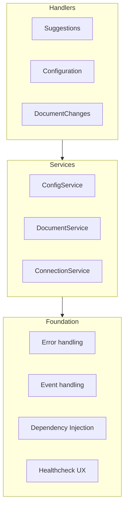

# Language Server Architecture Proposal

## Problem Statement

The KhulnaSoft Language Server (GLS) system was created as a proof-of-concept (POC) TypeScript rewrite of the Go Language Server POC. After the initial raw and untested GLS POC was written, we started adding features and tests in parallel. There were several big milestones in the implementation:

1. Initial POC
1. Adding telemetry
1. Integrating GLS to VS Code Extension
1. Adding streaming

Each of these milestones added new code and concepts, but generally speaking, we never cleaned up the concepts and design introduced by the previous stage.

The project has now reached a critical mass of both feature requests and engineers working on it, and the organic architecture of GLS no longer suffices. This manifests in several ways:

- Feature implementations are shotgun surgeries - even small code suggestion features touch all the main modules of GLS
- Merge conflicts - if everyone has to touch the core module when implementing their feature, there will be conflicts
- Fragile unit tests - modules tend to have too many dependencies, which we mock in tests. Each change tends to affect a large number of modules, breaking many unit tests

## Considerations

The [VS Code Extension](https://gitlab.com/gitlab-org/gitlab-vscode-extension) project has a very similar technology stack and will probably adopt parts of the GLS architecture over time.

## Proposed Architecture - High-Level View



On the high-level, application will be built from these three layers:

### Foundation

The green components on the diagram are marked as _Foundation_. They don't directly represent modules in the system but capabilities of the system. We need to design interfaces and maybe choose frameworks for these capabilities.

- **Dependency Injection** (DI) - We currently pass dependencies in constructors and init functions. This worked well on a smaller scale but with a larger number of modules, it makes the code harder to read. DI (and request/response context) will improve code readability and reduce conflicts.
- **Event handling** - We should implement a listener pattern to decouple low-level code from feature modules.
- **Error handling** - We should design a common pattern for logging and tracking errors. For example, every long-lived service can have a `HealthCheckable` interface to provide structured text with its internal state when a health-check is invoked.

### Long-Living Services

The bluish components in the diagram are _Long-living services_. These are modules that are created at the start of the GLS and live for the whole duration of the main process.

A _Long-living service_ has a single responsibility, such as tracking document changes, and provides data/functionality to other services and request pipelines.

These services will be initialized through DI and can be further injected into other services and request code.

The services will use _Event handling_ to expose changes to any interested client code. For example, ContextBuilder can listen for config changes to understand if the current file's language is supported for code suggestions.

The services will use _Error handling_ to log errors and report some of them to Sentry.

### Handlers

Handlers are modules that listen on the Language Server connection and handle incoming/outgoing requests and notifications.

#### Request Pipeline

Complicated requests go through many procedural steps. We agree that this sequence of steps that turns a request into a response should be modelled as a pipeline with middlewares operating on a shared context.

The pipeline design will make for an extensible and encapsulated business logic for handling requests.

The **pipeline design is a work in progress**, and we have an [open spike to find and implement a concrete solution](https://github.com/khulnasoft/khulnasoft-lsp/-/issues/251).

Example steps for handling code suggestion requests:

1. enrich the request with the content of the active file
1. try to retrieve cached suggestion
1. debounce
1. detect intent
1. add advanced context
1. make a request for suggestions
1. cache the response
1. map API response to LS response type

## Folder/package structure

We try to group the code by it's domain, not the type. For example, all code suggestion code goes to the same location. We **don't try** to co-locate *all* services or controllers together.

Also in general, we try to create a package for every large feature or for every utility concern like logging or dependency injection.

Examples:

- Utility packages: [logging](../../packages/lib_logging), [dependency injection](../../packages/lib_di)
- Libraries: [Message Bus](../../packages/lib_message_bus)
- Core LS features in [`@giltab-org/core`](../../packages/lib_core) - Although we would like to further split this package by domains to `config`, `api`, etc.

Webviews are separate frontend applications with different build than the packages. They've moved to a separate [`webviews` folder](../../webviews/).

## Design Options (Draft)

This section chooses an implementation for the Proposed Architecture. Take the following as an "RFC", not a final word.

### Dependency Injection (DI)

We, as a team, agree that we should use dependency injection to manage our dependencies. As the application grows, it's not maintainable to pass all dependencies through the call stack and initialize them in many places.

[Spike: Decide which dependency injection to use for TS systems](https://gitlab.com/gitlab-org/editor-extensions/meta/-/issues/114) is a spike that will decide on which DI implementation we'll use.

### Event Handling

Event-handling implementation discussion is in a **separate issue**: [Choose event handling implementation for LS](https://github.com/khulnasoft/khulnasoft-lsp/-/issues/244).

### Error Handling

When we get an error from a customer, it's difficult with our current error reporting and logging to find the root cause. We should enhance our error handling to give us more insight into the state of the system and pipeline when an error occurs.

#### Resiliency

The way we handle errors is critical for ensuring resiliency in the system.

- We need to distinguish between recoverable errors and panic errors clearly:
  - Recoverable errors occur when an expected edge case occurs. For example, we want to get open MR for a branch, but the API returns 404 error because there is no open MR.
  - Panic errors can't be recovered. Depending on which part of the application throws the error, it either terminates an action or the whole extension. When we panic, we should include Diagnostics with the error message.
- Any error visible to the user should include a possible solution(s) to the problem (e.g. "The request timed out. Please double check you can access your instance in a browser first."")

We should establish patterns and libraries to manage when a service can and cannot panic and improve the quality of messages and traces when a panic error happens.

There is [an existing issue](https://gitlab.com/gitlab-org/gitlab-vscode-extension/-/issues/1264) that we can re-purpose to track this discussion if the above guidelines aren't sufficient.

#### Tracking

We are using Sentry for error tracking. Check out [this epic](https://gitlab.com/groups/gitlab-org/editor-extensions/-/epics/51) for current state of Sentry integration. Sentry is a KhulnaSoft-wide tool for error tracking, the only one that's approved.

#### Logging

Our logging should be oriented towards capturing the system's state at the time of the error rather than an arbitrary sequence of debug logs. When a panic happens (see [Resiliency](#resiliency) for panic definition), we should capture the system's (_Long-living components_) and pipeline's (_per request components_, request and context) state. The error handler will have to have access to the DI container to compile the state information.

[This issue](https://github.com/khulnasoft/khulnasoft-lsp/-/issues/248) captures a follow-up discussion on structured and scoped logging.

#### Diagnostics

The system components should provide diagnostics information upon request. When an error occurs or when the user manually invokes diagnostics, we will ask each component to give us information about its state/health, aggregate the response and put it in the logs.

Rough example of the aggregated diagnostics response:

```txt
Account service:
- active account: viktomas (gitlab.com) (OAuth)
- configured accounts: viktomas (gitlab.com) (OAuth), fred-tester (self-managed) (PAT)

----
Git service:
- git repositories
  - /full/path/to/the/folder
    - remotes:
      - origin: git@github.com/group/project
      - fork: git@github.com/user/project
---
Duo pro:
- enabled for project: false
- user has license: true
```
