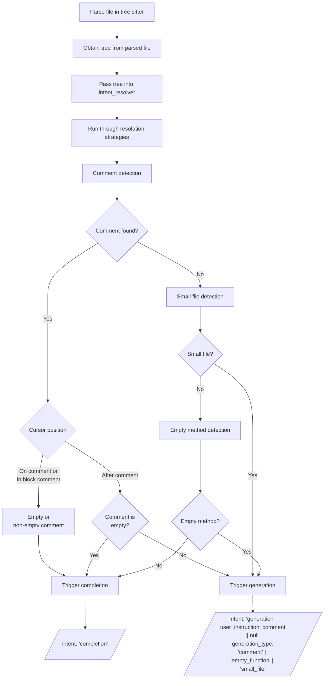

# Intent Detection Architecture

## Background Knowledge

KhulnaSoft Duo Code Suggestions support two types of suggestions. `generation` and `completion`.

- **code completion**: Calls Google Vertex AI (`code-gecko`) for a fast completion of current code using `prefix` and `suffix` of the user's cursor. This has limitations in the context window and model accuracy and reasoning since the model itself is smaller. This request goes through the AI gateway and will fallback to the monolith.
- **code generation**: Calls Anthropic (Claude 3.0) and provides a response that's generally larger and more complex than completion. Supported IDEs (for example, VS Code Extension) support streaming for generation. `prefix` and `suffix` is also sent for this request. This request goes through the monolith.

**Intent detection** is a process where we use cursor position to decide whether the user wants `completion` or `generation`

The `generation` requests are always sent to the monolith.

The `completion` requests are in ideal scenario [sent directly to AI Gateway](https://github.com/khulnasoft/khulnasoft-lsp/-/issues/183). However, if there are any issues with direct connection to AI Gateway, we fall back and send the `completion` request to the monolith.

### Monolith and intent detection

The monolith has intent detection logic that doesn't exist in the LS. That means that for certain cases, monolith decides that the intent is generation without the LS knowledge ([more context](https://github.com/khulnasoft/khulnasoft-lsp/-/issues/223#note_1915702452)).

The two cases are:

- [Detect Intent for Code Generation in Small Files](https://github.com/khulnasoft/khulnasoft-lsp/-/issues/173)
- [Detect Intent for Code Generation for Empty Function Blocks](https://github.com/khulnasoft/khulnasoft-lsp/-/issues/247)

## Architecture

We should move towards the following architecture:

1. We parse the file using Tree Sitter Parser.
1. Obtain a syntax tree from the parsed file.
1. Pass the tree into the intent_resolver.
1. The intent resolver takes the input of tree, prefix/suffix (if needed) and current cursor position and runs it through 3 resolution strategies in the following order (whichever resolves first will trigger `generation`):

   - **Comment detection**
     - When the cursor is directly on an empty or non-empty comment (or within a block comment), we use `completion` intent.
     - When the cursor is below a non-empty comment, use that as the `user_instruction` for the model, and pass `'comment'` as the `generation_type`.
   - **Small file detection**
     - Files with less than 5 non-comment lines are considered small files.
     - If a small file is detected, we pass `'small_file'` as the `generation_type`.
   - **Empty method/function detection**
     - If an empty method is detected, we pass `'empty_function'` as the `generation_type`.

1. We default to `completion` when a comment is empty, the file has more than 5 non-comment lines, and empty method was not detected.

- Note: the 3 resolution strategies should be chained in order, and return early once an intent is detected.
