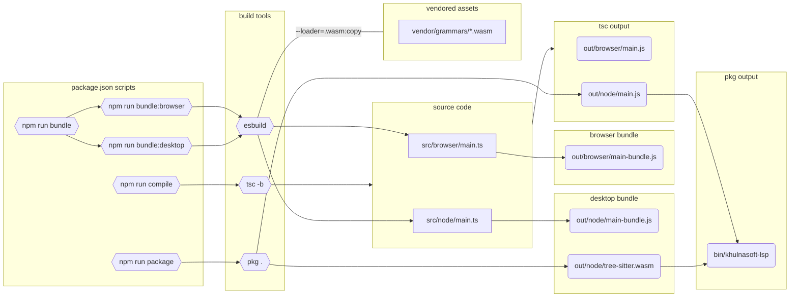

# Packaging

The Language Server project is used in varying desktop and browser environments.
This document describes the different build targets.

To illustrate the build process we first [compile](#compile) our source code, we
then [bundle](#bundle) it for desktop and browser environments which expect
dependencies to be provided for them, and finally we [package](#package) a
standalone desktop executable for environments where NodeJS may not be available.

## Compile

The `npm run compile` script typechecks TypeScript code and emits types used by downstream consumers.
Project configurations and shared options can be found in `tsconfig.json` and
`tsconfig.shared.json`.

## Bundle

The `npm run bundle` script invokes `bundle:desktop` and `bundle:browser` which invoke `esbuild`
with the appropriate platform and esbuild options.

The language server assumes that `path.join(__dirname, '../../../vendor/grammars/tree-sitter-<LANGUAGE>.wasm')` resolves to a readable path at runtime.

## Package

The `npm run package` script invokes [pkg](https://github.com/vercel/pkg#readme) to build a
standalone executable which doesn't require users to bring their own NodeJS runtime.

## Tree Sitter

We depend on the `web-tree-sitter` module to load `tree-sitter.wasm` and Web
Assembly language grammars.

The [decision](https://gitlab.com/groups/gitlab-org/-/epics/11568#note_1654589370)
was made to use `.wasm` over native extensions to keep consistency between our
different extensions.

We include these as assets in the desktop and browser builds.
