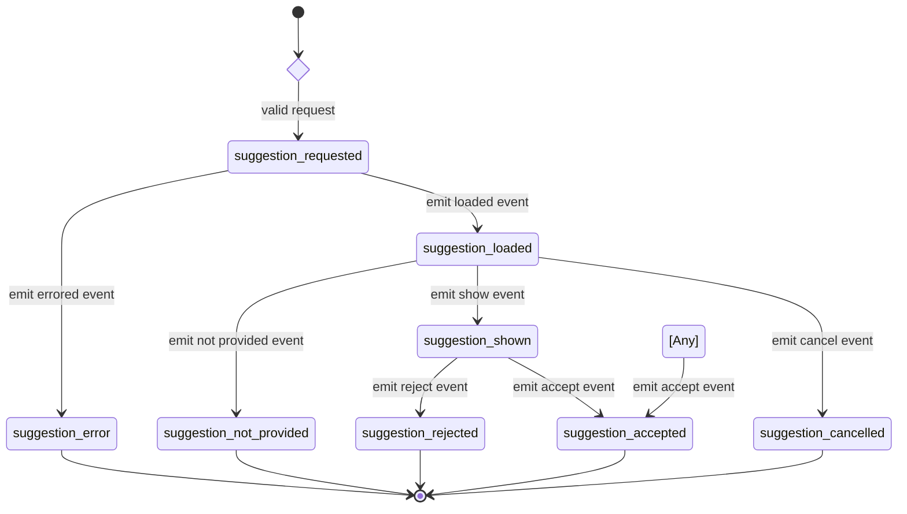
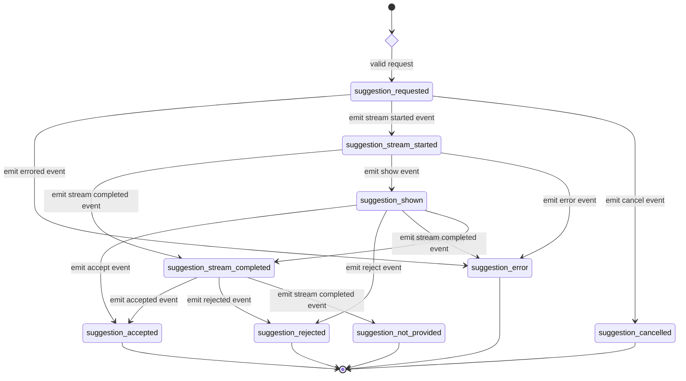

# Telemetry actions

The following table shows the available telemetry actions for code suggestions,
and who is responsible for sending each. When both the language server (LS) and extension (Ext) can
send a telemetry action, the extension must register to handle a specific action.

We prefer the extension to handle an action when possible, as the extensions
are more precise and have a better idea of what is actually happening in the IDE.
For example, if the language server handles the `suggestion_shown` action, it assumes
that if a suggestion is returned to the IDE, it is shown.

## Non-streaming suggestion

| Action                        | LS  | Extension | Description                                                              |
| ----------------------------- |-----|-----------| ------------------------------------------------------------------------ |
| `suggestion_requested`        | Yes | No        | Sent when the IDE extension requests a suggestion.                       |
| `suggestion_loaded`           | Yes | No        | Sent when the suggestion request came back either from network or cache. |
| `suggestion_error`            | Yes | No        | Sent when the suggestion request leads to an error.                      |
| `suggestion_shown`            | Yes | Yes       | Sent when the suggestion is started to be shown to the user.             |
| `suggestion_not_provided`     | Yes | Yes       | Sent when no suggestion was provided that could be shown to the user.    |
| `suggestion_accepted`         | No  | Yes       | Sent when the suggestion was shown, then accepted.                       |
| `suggestion_rejected`         | Yes | Yes       | Sent when the suggestion was shown, then rejected.                       |
| `suggestion_cancelled`        | Yes | Yes       | Sent when the suggestion request was canceled and not shown.             |

### State flow

The following state machine shows when each action is sent:

## Streaming suggestion

| Action                        | LS  | Extension | Description                                                                                        |
|-------------------------------|-----|-----------|----------------------------------------------------------------------------------------------------|
| `suggestion_requested`        | Yes | No        | Sent when the IDE extension requests a suggestion.                                                 |
| `suggestion_stream_started`   | Yes | No        | Sent when the first chunk of the suggestion stream was returned from the network.                  |
| `suggestion_error`            | Yes | No        | Sent when either of the suggestion stream requests leads to an error.                              |
| `suggestion_shown`            | Yes | No        | Sent when the first chunk of the streamed suggestion is started to be shown to the user.           |
| `suggestion_not_provided`     | Yes | No        | Sent when the stream has completed but no suggestion was provided that could be shown to the user. |
| `suggestion_accepted`         | No  | Yes       | Sent when the suggestion was shown partially or completely, then accepted.                         |
| `suggestion_rejected`         | Yes | No        | Sent when the suggestion was shown partially or completely, then rejected.                         |
| `suggestion_cancelled`        | Yes | No        | Sent when the suggestion request was canceled before the first chunk shown to the user.            |
| `suggestion_stream_completed` | Yes | No        | Sent when the last chunk of the streamed suggestion was returned from the network.                 |

### State flow

The following state machine shows when each action is sent:

### Exceptional transitions

Some end states can transition between them based on the
following criteria:

- Any state might transition to `suggestion_accepted`. The most common reason for this exceptional transition is accepting the suggestion after it was marked as rejected.
  This could occur due to a heuristic whereby any in-flight suggestions are marked as rejected as soon as a new completion request is received and only if the extension
  is not configured to handle the `suggestion_rejected` action.

## `suggestion_requested`

Sent when a suggestion is requested from the backend.

_Language server:_

The language server handles this telemetry action.

_IDE extensions:_

Only extensions that do not use the language server must implement this
action.

## `suggestion_loaded`

Sent when a suggestion request returns without error.

_Language server:_

The language server handles this telemetry action.

_IDE extensions:_

Only extensions that do not use the language server must implement this
action.

## `suggestion_error`

Sent when a suggestion request leads to an error.

_Language server:_

The language server handles this telemetry action.

_IDE extensions:_

Only extensions that do not use the language server must implement this
action.

## `suggestion_shown`

Sent when the suggestion is shown to the user.

_Language server:_

If the `suggestion_shown` action isn't registered as handled by the extension,
then the language server sends this action prior to returning a response to the
`textDocument/completion` LSP request.

_IDE extensions:_

If an IDE extension that uses the language server can determine when a suggestion
is shown to the user, or has logic to filter suggestions (not all suggestions
are shown), it should register to send this action and do so.

## `suggestion_not_provided`

Sent when no suggestion was provided that could be shown to the user.
This can happen if the suggestion doesn't meet a rule designed to
limit poor suggestions from being shown. For example: the suggestion
is all whitespace characters.

_Language server:_

The language server may send this action if the suggestions returned do not pass
filters designed to prevent poor suggestions from being shown. If the language
server does send the `suggestion_not_provided` action, it returns an empty set
of suggestions to the client.

If an IDE extension registers to send the `suggestion_not_provided` action, the
language server still performs filtering of suggestions and possibly
sends the action. To prevent duplicate `suggestion_not_provided` actions, the
language server must return an empty set `[]` of suggestions when the
`suggestion_not_provided` action is sent.

_IDE extension:_

If the IDE extension has a list of filters to prevent poor suggestions from being
shown to the user, it must register to handle the `suggestion_not_provided` action and
send it. Registering to handle this action does not prevent the language server
from also performing filtering of suggestions. Nor does it prevent the language
server from sending a `suggestion_not_provided` action and returning an empty set.

## `suggestion_cancelled`

Sent when the suggestion was not shown. For example, the user starts typing again
before the suggestion is shown.

_Language server:_

The language server doesn't send this action.

_IDE extension:_

If the IDE extension can determine if a suggestion being requested is interrupted,
it must register to handle the action, and send it when appropriate.

## `suggestion_accepted`

Sent when the suggestion was shown and then accepted by the user.

_Language server:_

If the `suggestion_accepted` action is registered to be handled by the extension,
then the language server does not send it.

If the `suggestion_accepted` action isn't registered as handled by the extension,
the action is never sent. In this case, suggestions are _not_ set to the
`rejected` state by the language server when a new completion request is received.

_IDE extension:_

If the IDE extension can determine if a suggestion is accepted, it must register
to handle the `suggestion_accepted` action and send it.

## `suggestion_rejected`

Sent when the suggestion was shown and then rejected by the user.

_Language server:_

If the `suggestion_rejected` action is registered to be handled by the extension,
then the language server does not send it.

If the client handles `suggestion_accepted`, but does _not_ also handle `suggestion_rejected`,
all unfinished suggestions are rejected when new suggestions are received.

_IDE extension:_

If the IDE extension can determine if a suggestion is rejected, it must register
to handle the `suggestion_rejected` action and send it.

## `suggestion_stream_started`

Sent when the first chunk of the suggestion stream was returned from the network.

_Language server:_

Only Language Server tracks this event.

_IDE extension:_

IDE extension does not track this event.

## `suggestion_stream_completed`

Sent when the full suggestion received and suggestion stream completed..

_Language server:_

Only Language Server tracks this event.

_IDE extension:_

IDE extension does not track this event.
